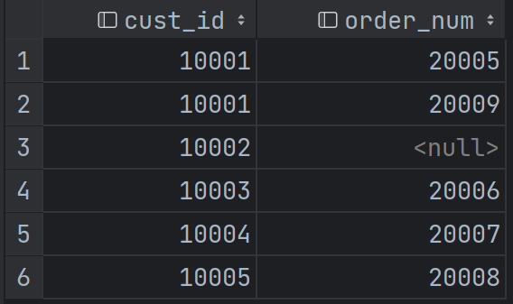
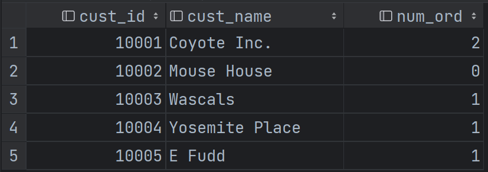

# MySQL

## SELECT语句
基本结构
```SQL
SELECT prod_id, prod_name, SUM(prod_price) AS sum_price
FROM products
WHERE prod_price <= 10 AND vend_id = 1003
GROUP BY prod_id
HAVING COUNT(*) >= 2
ORDER BY prod_price DESC, prod_name --DESC只作用于它前面的列
LIMIT 5
OFFSET 3; --行数从0开始算，偏移3行（即行3开始）
```
检索所有列，会降低性能
```SQL
SELECT *
FROM products;
```
检索不同的行，DISTINCT关键字，作用于所有列而不仅是前置它的列
```SQL
SELECT DISTINCT vend_id, prod_price
FROM products;
```
限制结果数量。LIMIT加一个数字显示前n行；两个数字分别表示第几行开始，显示多少行（行数从0开始）。
```SQL
LIMIT 3, 4;
--等同于
LIMIT 4   --取4行
OFFSET 3; --行3开始
```
WHERE子句可以用的操作符有：`=、!=、<、<=、>、>=、BETWEEN`。空值检查
```SQL
WHERE cust_email IS NULL;
```
WHERE子句可以用的逻辑操作符有：`AND、OR、IN、NOT`。使用圆括号分组逻辑操作符，保证优先级。
```SQL
WHERE vend_id IN (1002, 1003); --IN的用法
WHERE vend_id NOT IN (1002, 1003); --NOT否定后面的关键字
```

## 通配符和正则表达式
### 通配符
为了使用通配符，必须使用`LIKE`操作符。通配符有`'%'`和`'_'`两种。`'%'`表示任何字符出现任意次数(包括0次)。`'_'`只匹配单个字符(有且只有1次)。
```SQL
WHERE prod_name LIKE '%jet%';
WHERE prod_name LIKE '_ ton anvil';
```
***注意**，除非绝对有必要，否则不要把通配符用在模式的开始处，通配符放在开始处搜索起来最慢。

### 正则表达式
使用正则表达式必须用`REGEXP`操作符。`LIKE`匹配整个字符串而`REGEXP`匹配子串。
```SQL
WHERE prod_name REGEXP '1000'; --匹配包含文本'1000'的所有行
```
详细的正则表达式符号和类在`REGEXP.md`中。

## 计算字段

### 拼接字段
`Concat()`函数用于拼接字段。`Trim() LTrim() RTrim()`用于去除空格。`AS`关键字赋予计算字段一个别名。
```SQL
SELECT Concat(RTrim(vend_name), ' (', RTrim(vend_country), ')') AS vend_title
FROM vendors
ORDER BY vend_name;
```

### 执行算术计算
MySQL中可以用`+ - * /`来对字段执行算术计算。
```SQL
SELECT quantity*item_price AS expanded_price
```

### 数据处理函数
详情见`functions.md`。
```SQL
SELECT Upper(vend_name) AS vend_name_upcase
```

## 分组数据 
分组允许把数据分为多个逻辑组，以便能对每个组进行聚集计算。使用SELECT语句的`GROUP BY`子句创建分组。例子：
```SQL
SELECT vend_id, COUNT(*) AS num_prods
FROM products
GROUP BY vend_id;
```
`GROUP BY`子句指示MySQL按vend_id排序并分组数据，所以对每个vend_id而不是整个表计算num_prods。即`GROUP BY`子句指示MySQL分组数据，然后对每个组而不是整个结果集进行聚集。
`GROUP BY`子句有一些重要的规定：
1. `GROUP BY`子句可以包含任意数目的列，这使得能对分组进行嵌套。
2. 如果进行了嵌套，数据将在最后的分组上进行汇总。
3. `GROUP BY`子句中列出的每个列都必须是检索列或者有效的表达式（但不能是聚集函数）。如果在SELECT中使用表达式，则必须在`GROUP BY`子句中指定相同的表达式。不能使用别名。
4. **除聚集计算语句外，SELECT语句中的每个列都必须在`GROUP BY`子句中给出**。
5. 如果分组列中具有NULL值，则NULL将作为一个分组返回。如果列中有多行NULL值，它们将分为一组。
6. `GROUP BY`子句必须出现在WHERE子句之后，ORDER BY子句之前。

MySQL允许过滤分组。使用`HAVING`子句过滤分组。例子：
```SQL
SELECT vend_id, COUNT(*) AS num_prods
FROM products
GROUP BY vend_id
HAVING COUNT(*) >= 3;
```
`HAVING`子句过滤了COUNT(*) >= 3（总数大于3的供应商）的那些分组。

`WHERE`子句过滤行，在数据分组前进行过滤；`HAVING`子句过滤分组，在数据分组后进行过滤，仅配合`GROUP BY`子句使用。

## 子查询
子查询常用于IN操作符：
```SQL
SELECT cust_name, cust_contact
FROM customers
WHERE cust_id IN (SELECT cust_id
                  FROM orders
                  WHERE order_num IN (SELECT order_num
                                      FROM orderitems
                                      WHERE prod_id = 'TNT2'
                  ));
```

### 相关子查询
另一种常用的子查询用于计算列：
```SQL
SELECT cust_name, cust_state, (SELECT COUNT(*)
                               FROM orders
                               WHERE orders.cust_id = customers.cust_id) AS orders
FROM customers
ORDER BY cust_name;
```
customers表中共有五个记录，故子查询进行了五次，每次都告诉SQL对orders表中cust_id与当前customers表中检索的cust_id相同的记录进行一次子查询。

## 联结

### 等值联结/内部联结

```SQL
SELECT vend_name, prod_name, prod_price
FROM vendors, products
WHERE vendors.vend_id = products.vend_id
ORDER BY vend_name, prod_name;
```
`FROM`子句中给出了两个表`vendors, products`，两个表用`WHERE`子句正确联结。如果不使用`WHERE`子句提供联结条件，那么返回的结果为笛卡尔积，检索出的行的数目将是第一个表中的行数乘以第二个表中的行数，即第一个表中的每一行都将匹配第二个表中的所有行出现一次。使用了`WHERE`子句提供联结条件后，对于第一个表中的每一行，都将在第二个表中寻找满足联结条件的行进行检索并返回。

上述联结称为等值联结，它基于两个表之间的相等测试，也称为内部联结，可以用下述不同的语法实现：
```SQL
SELECT vend_name, prod_name, prod_price
FROM vendors INNER JOIN products
ON vendors.vend_id = products.vend_id
ORDER BY vend_name, prod_name;
```
`FROM`子句中两个表之间使用`INNER JOIN`关键字，同时`WHERE`关键字替换为`ON`关键字，返回结果相同。

SQL对一条SELECT语句中可以联结的表的数目没有限制。创建联结的基本规则也相同。首先列出所有表，然后定义表之间的关系。例如：
```SQL
SELECT prod_name, vend_name, prod_price, quantity
FROM orderitems, products, vendors
WHERE products.vend_id = vendors.vend_id
    AND orderitems.prod_id = products.prod_id
    AND order_num = 20005;
```
MySQL在运行时关联指定的每个表以处理联结，这种处理可能是非常耗费资源的。不要联结不必要的表，联结的表越多，性能下降越厉害。

### 表别名
别名还可用于表名，以此缩短SQL语句和允许在单条SELECT语句中多次使用相同的表：
```SQL
SELECT prod_name, vend_name, prod_price, quantity
FROM orderitems AS oi, products AS p, vendors AS v
WHERE p.vend_id = v.vend_id
    AND oi.prod_id = p.prod_id
    AND order_num = 20005;
```
与列别名不一样，表别名不返回客户机，仅在查询时使用。

### 自联结
```SQL
SELECT p1.prod_id, p1.prod_name
FROM products AS p1, products AS p2
WHERE p1.vend_id = p2.vend_id
    AND p2.prod_id = 'DTNTR';
```
上述SQL语句用于找出产品prod_id是'DTNTR'的供应商所提供的其他产品。通过表别名将products表看作不同的两个表p1，p2，使用p2.prod_id = 'DTNTR'过滤数据找出产品的供应商，再通过p1.vend_id = p2.vend_id找出这个供应商在p1表中所提供的其他产品。

### 自然联结
进行联结时，应该至少有一个列出现在不止一个表中（被联结的列）。标准的联结返回所有数据，甚至相同的列多次出现。自然联结排除多次出现，使每个列只返回一次。由用户完成这项工作：选择那些唯一的列。一般通过对表使用通配符（*），对其他所有表的列使用明确的子集来完成，确保没有相同的列出现：
```SQL
SELECT c.*, o.order_num, oi._prod_id
```

### 外部联结
外部联结包含了那些在相关表中没有关联行的行。例子：
```SQL
SELECT customers.cust_id, orders.order_num
FROM customers LEFT OUTER JOIN orders
ON customers.cust_id = orders.cust_id;
```
上述SQL语句检索所有客户，包括那些没有订单的客户，并找出该用户的所有订单。结果如下：


其中用户10002并没有任何属于他的订单，但是依旧出现在cust_id列中，由于他没有订单，所以他对应的order_num列是null。

使用`OUTER JOIN`语法时，必须使用`RIGHT`或`LEFT`关键字来指定包括其所有行的表。上述例子使用`LEFT`关键字，所以左边的表customers中的所有行都将返回，因此返回了用户10002。

### 使用带聚集函数的联结
```SQL
SELECT customers.cust_id, customers.cust_name, COUNT(orders.order_num) AS num_ord
FROM customers LEFT OUTER JOIN orders
ON customers.cust_id = orders.cust_id
GROUP BY customers.cust_id;
```
返回结果为：

## 组合查询
`UNION`关键字用于组合多条SELECT查询语句。`UNION`语句几乎总是完成与多个WHERE条件相同的工作。例子：
```SQL
SELECT vend_id, prod_id, prod_price
FROM products
WHERE prod_price <= 5
UNION
SELECT vend_id, prod_id, prod_price
FROM products
WHERE vend_id IN (1001,1002);
```
UNION使用规则：

1. UNION必须由两条以上的SELECT语句组成，语句之间用UNION分隔
2. UNION中的每个查询必须包含相同的列、表达式或聚集函数（可以不同次序）
3. 列数据类型必须兼容，不必完全相同
4. UNION自动取消了重复的行，如果想要返回所有匹配行，可使用`UNION ALL`
5. 在用UNION组合查询时，只能使用一条`ORDER BY`子句，它必须出现在最后一条SELECT语句之后。
